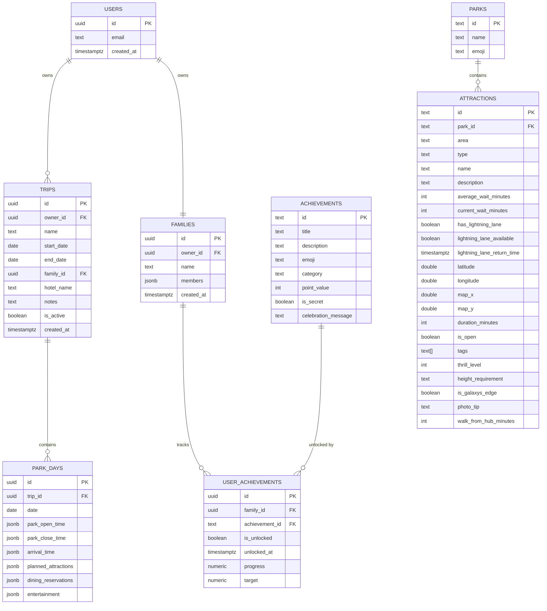

# Data Model

Phase 1 stores everything locally in IndexedDB (via Dexie — see
[`src/infrastructure/local/db.ts`](../src/infrastructure/local/db.ts)). This document designs the
**future Supabase (Postgres) schema** up front, per the project's "don't skip architecture"
requirement, even though it is not implemented until the Phase 2+ Supabase backend swap. The
shape intentionally mirrors the local Dexie strategy: flat, query-relevant top-level columns, with
deeply nested substructures (park days, planned attractions, dining reservations, entertainment,
family members) collapsed into `jsonb` columns rather than fully normalized — the same hybrid
pattern validated by the reference Flutter implementation's Drift schema.

## ERD



## Tables

### `trips`
Flat, query-relevant columns (`owner_id`, `is_active`, date range) plus a relation to `park_days`.
One row per trip; `owner_id` ties to Supabase Auth's `auth.users`.

### `park_days`
One row per day of a trip. `planned_attractions`, `dining_reservations`, and `entertainment` are
`jsonb` arrays — matching `PlannedAttraction[]` / `DiningReservation[]` / `EntertainmentEvent[]`
in `src/domain/entities/trip.ts` exactly, so the Postgres row deserializes directly into the
domain type. Indexed on `(trip_id, date)`.

Deliberately **no** `park_id`/`has_park_hopper`/`evening_park_id` columns — which park(s) a day
touches (and thus whether it's a park-hopping day) is derived by looking up each planned
attraction's `park_id` in `attractions`, not stored on the day itself. A stored single park with a
hopper flag couldn't represent hopping without extra state that could drift from what was actually
planned; deriving it from `planned_attractions` is always consistent. See
`getParksVisited` in `src/domain/rules/tripRules.ts`.

### `families`
One row per family. `members` is a `jsonb` array matching `FamilyMember[]` — the same
"flat top-level, nested JSON" strategy as `park_days`.

### `attractions`
**Reference/lookup data**, not per-user — shared across all users, seeded by an admin process
rather than written by the app. Indexed on `(park_id, area)` for the Command Engine's per-park
queries.

### `achievements`
The catalog of all possible achievements (shared reference data, like `attractions`).

### `user_achievements`
Per-family unlock/progress junction table between `families` and `achievements` — this is where
`isUnlocked`/`unlockedAt`/`progress` actually live once achievements move off the shared catalog
row (Phase 1's local `achievements` Dexie table conflates catalog + per-user state for
simplicity, since there's only ever one family; this split becomes necessary once there can be
multiple families/users on Supabase).

### `weather_cache` (optional)
Only needed if the Supabase phase wants to share a weather cache across users hitting the same
park coordinates rather than relying on Open-Meteo's own caching + the client-side IndexedDB
cache. Not required for correctness.

### Parks-per-day (client-side only, not a column)
The Planner's attraction picker shows every seeded attraction grouped by park (via
`PARK_NAMES`/`SelectGroup`), never filtered to a single "current" park — a day's parks (and
whether it's hopping) are whatever `getParksVisited` derives from its `planned_attractions`. There
is no separate "Destination"/resort-grouping concept anymore; it was only used to filter the old
single-park picker and became dead weight once selection stopped being filtered by park.

## Row Level Security (RLS)

Once on Supabase, every user-owned table (`trips`, `families`, `park_days` via join,
`user_achievements` via join) gets a policy of the shape:

```sql
create policy "owner_can_read_write"
  on trips for all
  using (auth.uid() = owner_id)
  with check (auth.uid() = owner_id);
```

`park_days` inherits ownership through its `trip_id` foreign key (policy checks
`trip_id in (select id from trips where owner_id = auth.uid())`). `attractions` and
`achievements` are read-only reference data — RLS allows `select` to any authenticated user and
`insert`/`update`/`delete` only to a service-role seeding job.

## JSON field naming

All `jsonb` fields use the exact same camelCase field names as the TypeScript domain types
(`plannedOrder`, `isCompleted`, `lastHydrationReminder`, etc.) rather than converting to
snake_case — this means a Supabase row can be passed straight through the same zod schemas used
to validate local seed data, with zero field-mapping code required.
